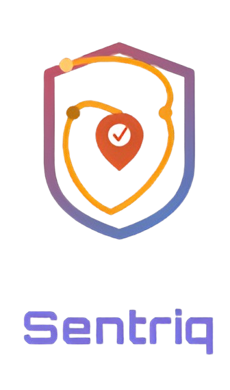
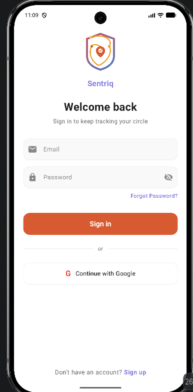
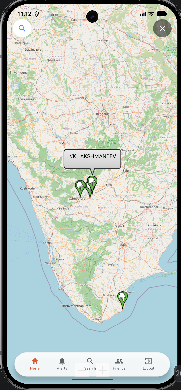
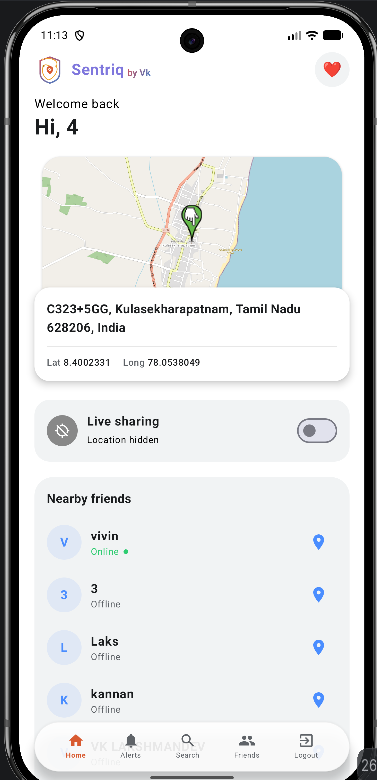
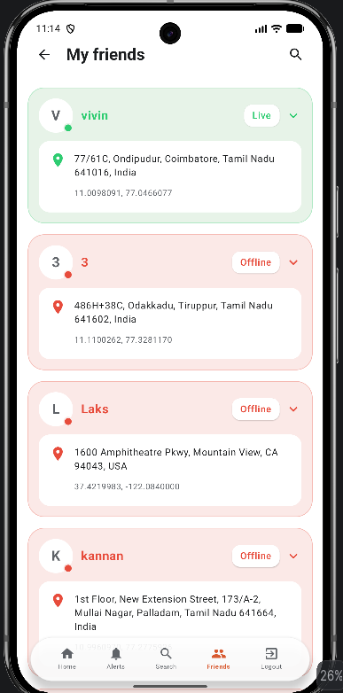
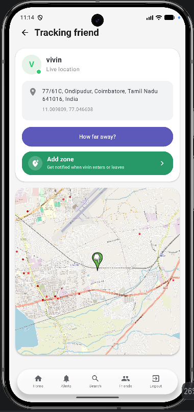
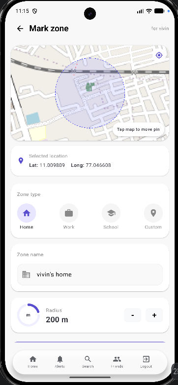

<div align="center">



**A native Android safety companion that keeps you and the people you trust within reach — in real time.**

[](#)
[](#)
[](#)
[](#)

[](#)
[](#)
[](#)

### 📲 [Download Latest APK](../../releases/latest)

</div>

---

## 🌟 Overview

Personal safety shouldn't feel complicated. **Sentriq** is a native Android app that quietly works in the background — sharing your live location with the people you trust, watching over the places that matter to you, and standing ready to raise the alarm the moment you need it.

Built entirely with **Kotlin and Jetpack Compose**, Sentriq combines a clean, modern UI with serious system-level engineering: persistent background location tracking, geofenced safety zones, and real-time Firebase sync — all wrapped in a calm, purposeful design.

---

## 📸 Preview

<div align="center">

| Splash Screen | Live Map | Dashboard |
|---|---|---|
|  |   |   |

| Friends Page | Tracking Friends | Mark Zons |
|---|---|---|
|   |   |   |

</div>

---

## ✨ Features

| | |
|---|---|
| 📍 **Live Location Sharing** | Real-time location streamed securely to trusted contacts, so the people closest to you always know you're okay. |
| 🆘 **Emergency Alerts** | Instant alerts the moment something needs attention — no delay, no friction. |
| 🤝 **Guardian Network** | Send, receive, and manage friend requests to build your own circle of trust. |
| 🔎 **Find Friends** | Search and connect with other Sentriq users to grow your guardian network. |
| 🗺️ **Interactive Live Map** | A clean Google Maps experience, built with Maps Compose, that turns coordinates into something you can act on. |
| 🚧 **Safety Zones & Geofencing** | Draw a boundary around any place that matters. Sentriq silently watches it and fires an alert the moment someone enters or exits. |
| ☁️ **Real-Time Cloud Sync** | Firebase Realtime Database keeps every device, contact, and zone perfectly in sync, instantly. |
| 🔐 **Secure Authentication** | Sign in with email/password or Google Sign-In, backed by Firebase Authentication. |
| 🔄 **Background Resilience** | A persistent foreground location service keeps tracking alive even when the app is closed — and restarts itself automatically after a device reboot. |

---

## 🛠️ Tech Stack

**Language & UI**
- Kotlin
- Jetpack Compose (Material 3)
- Navigation Compose

**Backend & Data**
- Firebase Authentication (Email + Google Sign-In)
- Firebase Realtime Database

**Location & Maps**
- Google Maps Compose
- Play Services Location
- Foreground Service + Boot Receiver for always-on tracking

**Tooling**
- Android Studio
- Gradle Kotlin DSL (`build.gradle.kts`)
- Git & GitHub

---

## 🏗️ Architecture Highlights

Sentriq's screens are organized around a single-activity, Compose Navigation architecture:

```
Splash → Login / Register / Forgot Password
            ↓
        Dashboard ──┬── Map Screen
                     ├── Friends / Friend Requests / Search Friends
                     ├── My Zones → Edit Zone / Zone Map
                     └── Alerts
```

**Key engineering pieces:**
- `LocationForegroundService` — keeps live location tracking running independently of the app's UI lifecycle
- `BootReceiver` — automatically restarts location tracking after the device reboots, so protection never has a gap
- `StopSharingReceiver` — lets a user cleanly stop sharing from a notification action
- `ZoneAlert` + geofencing logic — detects and timestamps zone entry/exit events per friend
- Custom Compose-based animated branding (`GuardianLogo`, `VkSignature`) built with path-based stroke animation — no static image assets required

---

## 🎨 Brand Identity

<div align="center">

</div>

Sentriq's visual identity is built around one idea — **a shield that moves with you.**

- A **shield silhouette** outlined in a smooth magenta-to-blue gradient, open and unfilled — protection that feels light, not heavy
- A **gold/orange route line** looping through the shield, marked with two waypoint dots — the path you take, traced and held safe
- A **red map pin with a white checkmark** at the center — the destination reached, the "you're okay" signal at the heart of the brand
- An **Orbitron** bold wordmark, "Sentriq," rendered in the same purple-to-blue gradient as the shield — clean, geometric, and tech-forward

Together, the mark reads less like a lock and more like a journey — a route safely walked, checked off, and watched over the whole way.

---

## 📲 Get the App

**[⬇️ Download the latest APK](../../releases/latest)**

### Install steps
1. Download the APK from the link above
2. On your Android device, allow installs from unknown sources if prompted (Settings → Security)
3. Open the downloaded file and tap **Install**
4. Launch Sentriq and sign in (or create an account) to get started

---

## 🗺️ Roadmap

- [ ] Push notifications for emergency alerts
- [ ] In-app chat with guardians
- [ ] Offline mode with local caching
- [ ] Wear OS companion for one-tap SOS
- [ ] Battery usage optimization for long-duration tracking

---

## 📬 Contact

Interested in this project, a demo, or collaborating? Feel free to reach out — I'd love to talk about it.

---

<div align="center">

**Sentriq** — *because the people who matter to you deserve to know you're okay.*

</div>
